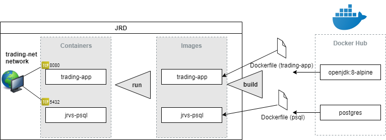
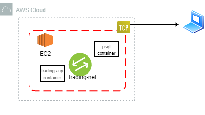
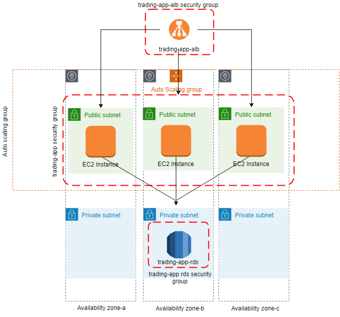
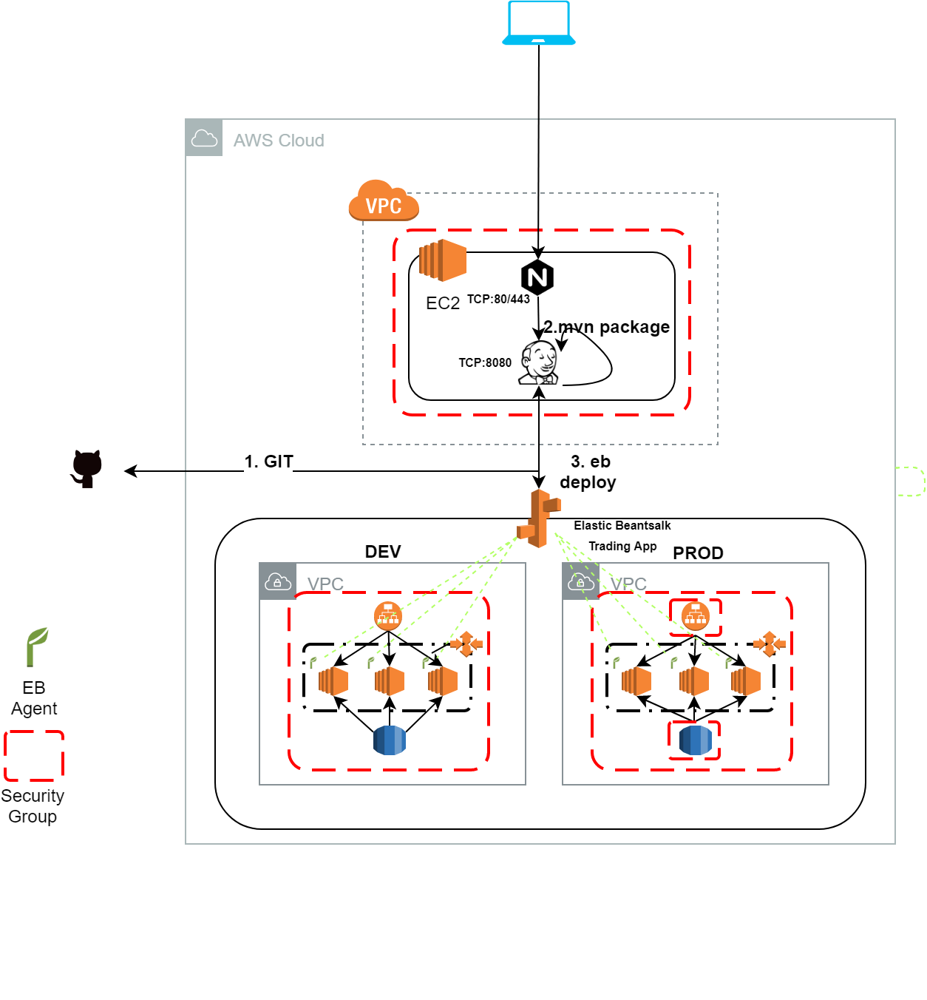

# Introduction
In this README, you will get to know how I was able to deploy my Trading-Application. The trading-app ([https://github.com/saud-aslam/trading-app](https://github.com/saud-aslam/trading-app)) is an online stock trading simulation REST API which can be used to create an account which would allow account holder to buy and sell stocks from Investor Exchange i.e IEX. Traders can withdraw money and/or deposit money into their account. They can also view latest quotes of any stock directly from this application. This REST API can be used by front-end developers, mobile-app developers, and traders. The architecture used here is based on microservices concept which is implemented using SpringBoot, IEX API and PSQL database. The SpringBoot controller embeds Apache Tomcat which binds our application with HTTP requests.

The deployment of this application to cloud was done on Amazon Web Services (AWS). But before that we dockerized our trading-application so that we can load our application containers on remote servers (EC2 instances). We, then, did manual deployment on AWS cloud. After manually deploying our application, we used Elastic Beanstalk to automatically manage our application on Cloud. Lastly, we used CI/CD pipeline through Jenkins, to further automate our deployment process.


# Dockerize Trading Application

The aim was to deploy the application on EC2 instances by running docker containers of our application on it. Since our application also runs Postgresql database, we need an extra container in addition of the parent application container. Both of these containers are independent to each other but we need them to communicate. For that a network bridge is created in docker. 
#### DockerFiles
There are two Dockerfiles each for each containers. These dockerfiles have commands in them which pulls docker images from DockerHub and creates local images in our docker and then when we run our local images, we get our containers. The trading-app dockerfile loads two images from DockerHub: ***Maven*** image which is used to build and package the source code by following pom.xml; ***openjdk:8-alpine*** which is use to run our java application; ***postgres*** which is used to run postgres database and  also build all tables based on the schema which is provided under *trading_ddl* folder.


## Commands to dockerize trading-app

```
sudo docker network create --driver bridge trading-net .

```
```
sudo docker build -t trading-app .

```
```
sudo docker run \
-e "PSQL_URL=jdbc:postgresql://psql:5432/jrvstrading" \
-e "PSQL_USER=postgres" \
-e 'PSQL_PASSWORD=password' \
-e "IEX_PUB_TOKEN=YOUR_TOKEN" \
--network trading-net \
-p 8080:8080 -t trading-app

```

## Commands to dockerize jrvs-psql


```
cd psql

sudo docker build -t jrvs-psql .

sudo docker run --name jrvs-psql \
-e "POSTGRES_PASSWORD=$PSQL_PASSWORD" \
-e POSTGRES_DB=jrvstrading \
-e "POSTGRES_USER=$PSQL_USER" \
--network trading-net \
-d -p 5432:5432 jrvs-psql

```

This completes the process of dockerizing our application. The diagram below shows the process.
 <p align="center">
 </p>
  


# Manual Deployment on AWS cloud

To deploy the application on AWS cloud, I did some configuration on Amazon Web services platform as follows:
- Provison a EC2 instance.
- Create a security group with TCP 8080 protocol.
- Launch the instance.

Once the instance is running, it was time to configure the instance to run the trading-app. To do it :
- SSH to the ec2 server : `ssh -i ~/.ssh/pem/you_pem_key ec2-user@ec2_pub_ip`.Note: pem keys would be prompted to be generated when creating an instance. You need to store that key in .ssh directory of your local machine.
- Install docker 
- Start and Enable docker
- Install Git and Clone git trading-app repo : `git clone https://[https://github.com/saud-aslam/trading-app`
- docker build and run to dockerize the app and mentioned below.
-ssh to EC2 public ip from the laptop's browser as like this: http://{EC2_pubic_ip}:8080/swagger-ui.html

The below diagram shows how the the ec2 server resides the docker containers.

<p align="center">
  </p>


# Jenkins and Elastic Beanstalk

The problem with the above approach is that it took a while to set it up, and updating my project way too time consuming. If I wanted to use a newer version of my app, I basically needed to log in to each instance and pull the latest docker image.  
Luckliy, Elastic Beanstalk (EB) can fully automate the process. After setting up an EB project with the desired environment variables and port forwards, I can simply upload a jar file of the latest version of my trading-app to have it run on all the automatically generated instances. Then, whenever I want to update my project I simply upload a new jar file.

But there are two problems to consider:

1.  In a production environment I don't want to upload a jar file to find out it crashed all my servers.
2.  I don't want every developer logging in to AWS and uploading their own jar files onto the same project.

The first problem is easy: I created two EB projects -- tradingApp-dev and tradingApp-prod -- that way I could test my new jar files on the dev servers first.

For the second problem, I used Jenkins: I made a new EC2 instance to host a Jenkins server behind an NGINX reverse proxy. I set up Jenkins to listen to the project's GitHub repo, pull new commits, build new jar files, then push them to EB. I set it up to listen to the dev branch for tradingApp-dev, and the master branch for tradingApp-prod.


 <p align="center">
</p>

  <p align="center">
</p>

<!--stackedit_data:
eyJoaXN0b3J5IjpbMTQxNDM4NDE4OSwtMTM0MDk0OTE0NCwxND
IxMDI4ODAxLC00OTcxNTkzMjksMTYzMDc0MjIwLDQ3NDMxOTE5
NCwtMzA1MDE3OTgwLDE4MjcwMTM4MTEsLTE2MTc2MTg4MjIsMj
A2ODIzMTkzNywtMzk0MzE3ODEwXX0=
-->