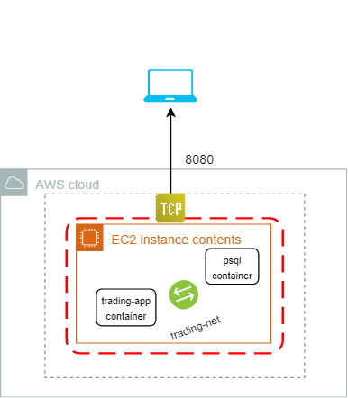

# Introduction
In this README, you will get to know how I was able to deploy my Trading-Application on Amazon Cloud Server. The trading-app ([https://github.com/saud-aslam/trading-app](https://github.com/saud-aslam/trading-app)) is an online stock trading simulation REST API which can be used to create an account which would allow account holder to buy and sell stocks from Investor Exchange i.e IEX. Traders can withdraw money and/or deposit money into their account. They can also view latest quotes of any stock directly from this application. This REST API can be used by front-end developers, mobile-app developers, and traders. The architecture used here is based on microservices concept which is implemented using SpringBoot, IEX API and PSQL database. The SpringBoot controller embeds Apache Tomcat which binds our application with HTTP requests.

The deployment of this application to cloud was done on Amazon Web Services (AWS). But before that we dockerized our trading-application so that we can load our application containers on remote servers (EC2 instances). We, then, did manual deployment on AWS cloud. After manually deploying our application, we used Elastic Beanstalk to automatically manage our application on Cloud. Lastly, we used CI/CD pipeline through Jenkins, to further automate our deployment process.


# Dockerize Trading Application

The aim was to deploy the application on EC2 instances by running docker containers of our application on it. Since our application also runs Postgresql database, we need an extra container in addition of the parent application container. Both of these containers are independent to each other but we need them to communicate. For that a network bridge is created in docker. 
#### DockerFiles
There are two Dockerfiles each for each containers. These dockerfiles have commands in them which pulls docker images from DockerHub and creates local images in our docker and then when we run our local images, we get our containers. The trading-app dockerfile loads two images from DockerHub: ***Maven*** image which is used to build and package the source code by following pom.xml; ***openjdk:8-alpine*** which is use to run our java application. The psql dockerfile loads one image from DockerHub: ***postgres*** which is used to run postgres database and also creates database and builds all tables based on the schema which is provided under *psql/trading_ddl* folder.


## Commands to dockerize trading-app

```
sudo docker network create --driver bridge trading-net .

```
```
sudo docker build -t trading-app .

```
```
sudo docker run \
-e "PSQL_URL=jdbc:postgresql://psql:5432/jrvstrading" \
-e "PSQL_USER=postgres" \
-e 'PSQL_PASSWORD=password' \
-e "IEX_PUB_TOKEN=YOUR_TOKEN" \
--network trading-net \
-p 8080:8080 -t trading-app

```

## Commands to dockerize jrvs-psql


```
cd psql

sudo docker build -t jrvs-psql .

sudo docker run --name jrvs-psql \
-e "POSTGRES_PASSWORD=$PSQL_PASSWORD" \
-e POSTGRES_DB=jrvstrading \
-e "POSTGRES_USER=$PSQL_USER" \
--network trading-net \
-d -p 5432:5432 jrvs-psql

```

This completes the process of dockerizing our application. The diagram below shows the process.
 <p align="center">
 </p>
  


# Manual Deployment on AWS cloud

To deploy the application on AWS cloud, I did some configuration on Amazon Web services platform as follows:
- Provison a EC2 instance.
- Create a security group with TCP 8080 protocol.
- Launch the instance.

Once the instance is running, it was time to configure the instance to run the trading-app. To do it :
- SSH to the ec2 server : `ssh -i ~/.ssh/pem/you_pem_key ec2-user@ec2_pub_ip`. Note: pem keys would be prompted to be generated when creating an instance. You need to store that key in .ssh directory of your local machine.
- Install docker 
- Start and Enable docker
- Install Git and Clone git trading-app repo : `git clone https://github.com/saud-aslam/trading-app`
- docker build and run to dockerize the app as mentioned above.
-ssh to EC2 public ip from the laptop's browser as like this: http://{EC2_pubic_ip}:8080/swagger-ui.html

The below diagram shows how the the ec2 server resides the docker containers.
<p align="center">
 </p>

So far in the manual deployment we used our local database which is running on EC2 instance. We went a little advance in the approach and rather than running local psql container in the instance, we used AWS database service i.e RDS. This allows us to run our trading-app container on ec2 instances and database container on a separate private subnet database server. Further we also created autoscaling group and a load balancer which would automatically scale-up and scale-down the instances based on the  http request volume on Load balancer.

The architecture is shown below.
<p align="center">
</p>

# Elastic Beanstalk and Jenkins

The manual deployment of our trading-app which is performed above has a problem i.e It is time consuming to manually deploy the application on every instances whenever there is an update in our code. It will not be fun to docker build the application component on every instances.

This problem is solved by using Elastic Beanstalk (EB). By using this service of AWS, one can fully rely on EB to manage and upload the latest version of the code in all the running instances. All we need to do is to *mvn package* our source code and upload the jar/zip file. We also created two environment, namely, Development and Production.

Going further, we did more automation as we wanted to get rid of maven packaging and uploading our application jar/zip file every time there is a change in the code. To achieve this, we created a CI/CD pipeline by using Jenkins. Basically a Jenkinfiles is needed by Jenkins which manages this pipeline process. Whenever there is a new commit in the github repository, the jenkin server sitting in a newly created EC2 instance, will git pull and then  mvn package followed by creating the jar/zip of our application would either deploy our application on production or development environment based on the github branch being committed. The eb_deploy scripts are called in the Jenkinfiles. These scripts deploy the application's jar/zip file.
This diagram shows the architecture of the deployment with Elastic Beanstalk and Jenkins.

 <p align="center">
</p>


<!--stackedit_data:
eyJoaXN0b3J5IjpbLTE3Mzg1NzI4NzcsLTMxODU0OTY5OSwtMT
YxNzY4OTU2LC0yMDc0MTQxNzQ1LDU2MTg1MzEyMSwtNDgzODM5
MTg2LDk3MTc3MTI1MSwxODgyNDMyODA1LC0yMTY5MDQ1NTcsLT
EzNDA5NDkxNDQsMTQyMTAyODgwMSwtNDk3MTU5MzI5LDE2MzA3
NDIyMCw0NzQzMTkxOTQsLTMwNTAxNzk4MCwxODI3MDEzODExLC
0xNjE3NjE4ODIyLDIwNjgyMzE5MzcsLTM5NDMxNzgxMF19
-->
